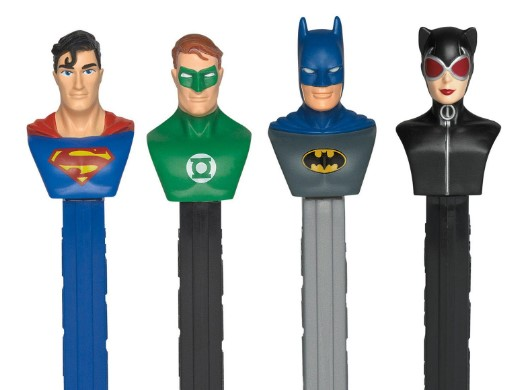

<div align="center">
<h1>
PEZ DISPENSER
</h1>
</div>


### About the project:
<div>
<details>
<summary>Picture</summary>

</details>
</div>
<div>
Welcome to the PEZ Dispenser project!
This project is dedicated to the fascinating world of PEZ dispensers, 
those iconic candy dispensers that have brought joy to people of all 
ages for decades.
</div>

### Build With:
<li>
Java
</li>
<li>
IntellyJ 
</li>

### Usage:
<div>
<ol>
<li>
Open IntellyJ
</li>
<li>
Copy Pez Dispenser project repository link 

````s
https://github.com/VGabrans/PezDispenser.git
````
</li>
<li>
Open IntellyJ and paste link in :<br>
a. Click : File - New - Project from Version Control<br> 
a.a. enter link in URL field and press CLONE
</li>
<li>
Open : 
<br>
 a. src\main\org\examples\PezDispenser
<br>
Class: PezDispenser is about project logic 
<br>
 b. src\test\Java\PezDispenserUsage
<br>
Class: PezDispenserUsage (here you will run it )
</li>
<li>
Class: PezDispenserUsage<br>
 a. Use this to eat candy.

````s
Batman.eatCandy();
````

 b. Use this to charge candy.If you wish chard more candy change number:
 
    

````s
 Batman.candyReload(1);
 System.out.println(Batman);
````
</li>
</ol>
</div>

### Usage in real life:
<ol>
<li>
Acquire a PEZ Dispenser:<br>
a.  Purchase a PEZ dispenser from a local store, candy shop, or online retailer. PEZ dispensers come in various designs and themes.
Get PEZ Candy Refills:
</li>
<li>
Get PEZ Candy Refills:<br>
b. PEZ candy typically comes in small, rectangular packs. 
Purchase additional PEZ candy refills to use with your dispenser. 
They are available in various flavors.
</li>
<li>
Open the Dispenser:<br>
c. Most PEZ dispensers have a hinged head that opens to reveal a slot for inserting the PEZ candy.
Hold the dispenser with one hand and gently lift the head with the other.
</li>
<li>
Insert PEZ Candy:<br>
d.Take a pack of PEZ candy and slide it into the slot in the dispenser, 
making sure the candies are facing forward. 
Push the candy pack down until it is securely in place.
</li>
<li>
Close the Dispenser:<br>
e. Lower the head of the dispenser until it clicks or snaps shut.
The dispenser is now loaded and ready to dispense candy.
</li>
<li>
Dispense Candy:<br>
f.To dispense a piece of candy, push back the head of the dispenser. 
This action will release one PEZ candy from the pack, 
and it will pop out of the dispenser's neck.
</li>
<li>
Enjoy the Candy:<br>
g. Once the candy is dispensed, grab it and enjoy! 
PEZ candies are known for their distinctive flavors, 
and part of the fun is enjoying the candy in small, flavorful bites.
</li>
<li>
Repeat:<br>
h. The dispenser is designed for multiple uses. 
Repeat the process as needed until all the 
candy in the dispenser is consumed. If you run out of candy, 
simply reload the dispenser with a new pack.
</li>
</ol>

## Usage Rules:
<ol>
<li>
12 candy in dispenser
</li>
<li>
You cant charge more than 12 candy
</li>
<li>
You cant charge less than 12 candy
</li>
</ol>

